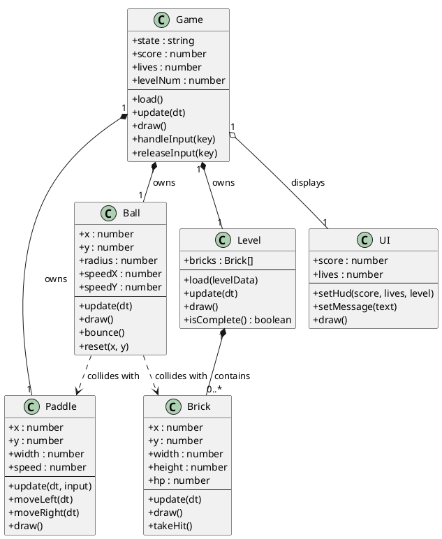

# Architecture

Object-oriented design for the Breakout clone. Every class follows the
**single responsibility principle**: it knows its own data (attributes) and
does its own job (methods), delegating anything else to collaborators.

## Class diagram

> Source: [`uml/class-diagram.puml`](uml/class-diagram.puml) — render it with
> `java -jar plantuml.jar -Playout=smetana docs/uml/class-diagram.puml`,
> the PlantUML extension for VS Code, or by pasting it into
> [PlantText](https://www.planttext.com).

## Responsibilities

| Class  | Attributes | Methods | Collaborators |
|--------|------------|---------|---------------|
| Ball   | x, y, radius, speedX, speedY | `new(x,y,radius)`, `update(dt)`, `draw()`, `bounce()`, `reset(x,y)` | Paddle, Brick (collisions) |
| Paddle | x, y, width, speed | `new(x,y,width,speed)`, `update(dt, input)`, `moveLeft(dt)`, `moveRight(dt)`, `draw()` | Game (receives the input state) |
| Brick  | x, y, width, height, hp | `new(x,y,w,h,hp)`, `update(dt)`, `draw()`, `takeHit()` | Level (belongs to it) |
| Level  | bricks | `new()`, `load(levelData)`, `update(dt)`, `draw()`, `isComplete()` | Brick |
| Game   | state, score, lives, levelNum, input, ball, paddle, level, ui | `load()`, `update(dt)`, `draw()`, `handleInput(key)`, `releaseInput(key)` | Ball, Paddle, Level, UI |
| UI     | score, lives, level, message | `new()`, `setHud(score,lives,level)`, `setMessage(msg)`, `draw()` | Game (renders what it is given) |

## Relationships

- **Composition** — `Game` owns `Ball`, `Paddle` and `Level`; a `Level` is
  composed of `Brick`s. Entities do not outlive their owner.
- **Aggregation** — `Game` references `UI`; the UI can be swapped or shared.
- **Association** — `Ball` asks `Paddle` and `Brick` for collision checks. The
  `Paddle` does not talk back to `Game`: `Game` owns the input state and passes
  it down as `paddle:update(dt, input)`, so the flow stays one-directional.

## Design notes

- The `Game` class is the only owner of the state machine; entities never
  decide game flow.
- `Level` isolates layout data so `Game` does not manage brick positions.
- Physics is intentionally deferred: classes expose `update(dt)` so movement
  and collisions can be added without changing the API.