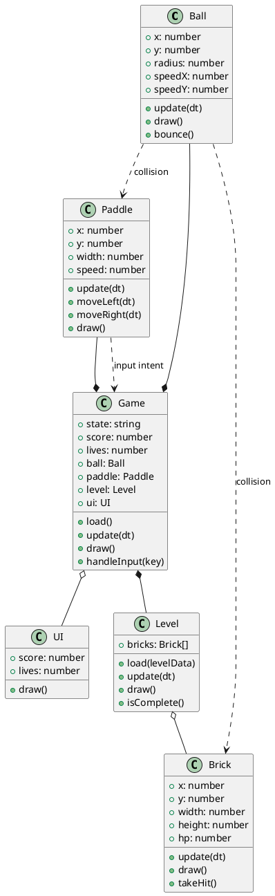

# Architecture

Object-oriented design for the Breakout clone. Every class follows the
**single responsibility principle**: it knows its own data (attributes) and
does its own job (methods), delegating anything else to collaborators.

## Class diagram

## Responsibilities

| Class   | Attributes                    | Methods                            | Collaborators           |
|---------|-------------------------------|------------------------------------|-------------------------|
| Ball    | x, y, radius, speedX, speedY  | update(dt), draw(), bounce()       | Paddle, Brick (collisions) |
| Paddle  | x, y, width, speed            | update(dt), moveLeft(dt), moveRight(dt), draw() | Game (input) |
| Brick   | x, y, width, height, hp       | update(dt), draw(), takeHit()      | Level                   |
| Level   | bricks                        | load(levelData), update(dt), draw(), isComplete() | Brick                |
| Game    | state, score, lives, entities | load(), update(dt), draw(), handleInput(key) | Ball, Paddle, Level, UI |
| UI      | score, lives                  | draw()                             | Game                    |

## Relationships

- **Composition** — `Game` owns `Ball`, `Paddle` and `Level`; a `Level` is
  composed of `Brick`s. Entities do not outlive their owner.
- **Aggregation** — `Game` references `UI`; the UI can be swapped or shared.
- **Association** — `Ball` asks `Paddle` and `Brick` for collision checks; the
  `Paddle` signals input intent to `Game`.

## Design notes

- The `Game` class is the only owner of the state machine; entities never
  decide game flow.
- `Level` isolates layout data so `Game` does not manage brick positions.
- Physics is intentionally deferred: classes expose `update(dt)` so movement
  and collisions can be added without changing the API.