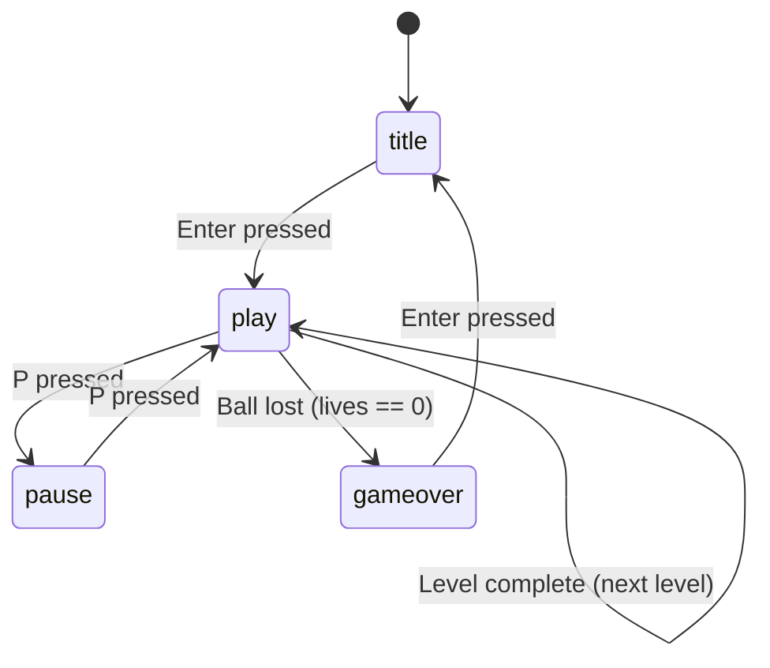

# State machine

The game flow is a finite state machine (FSM). In the ACA 2 implementation,
a reusable `StateMachine` owns the current state and delegates the active
state's `enter`, `update`, `draw`, and `keypressed` behavior. The old image
and Mermaid reference below are retained as the ACA 1 model.

## Current ACA 2 state model

| State      | Entry and exit behavior                                                   |
|------------|---------------------------------------------------------------------------|
| `title`    | Start screen; Enter or Space starts a new game and moves to `serve`.      |
| `serve`    | The ball waits on the paddle; Enter or Space launches it and moves to `play`. |
| `play`     | Active gameplay; `P` or `Esc` pauses, losing every ball loses a life or ends the game, and clearing the level advances or wins. |
| `pause`    | No `update` runs, so the run remains frozen; `P` resumes and `Esc` returns to `title`. |
| `gameover` | Final screen when lives reach zero; `R` or Enter returns to `title`.     |
| `victory`  | Final screen after clearing all levels; `R` or Enter returns to `title`.  |

## ACA 1 reference transitions

> Source: [`uml/state-machine.puml`](uml/state-machine.puml).

Mermaid source

## Current ACA 2 transitions

The current implementation is covered by the reusable machine and the six
state modules, not only by the archived diagram below.

| From               | Trigger                      | To                |
|--------------------|------------------------------|-------------------|
| `title`            | Enter or Space               | `serve`           |
| `serve`            | Enter or Space               | `play`            |
| `play`             | P or Esc                     | `pause`           |
| `pause`            | P                            | `play`            |
| `pause`            | Esc                          | `title`           |
| `play`             | All balls lost, lives left   | `serve`           |
| `play`             | All balls lost, no lives     | `gameover`        |
| `play`             | Level completed               | `serve` or `victory` |
| `gameover`/`victory` | R or Enter                 | `title`           |

`title`, `serve`, `pause`, `gameover`, and `victory` respond to keyboard input,
while `play` also advances through timing, collisions, and level completion.
Each screen lives in a separate file under `src/states/`.

## Edge cases covered

- **Ball lost** — if the player still has lives, a new ball is served; otherwise the game moves to `gameover`.
- **Level complete** — when all bricks are destroyed, the game loads the next layout and serves a new ball; if there are no more layouts, it moves to `victory`.
- **Pause** — `pause` does not implement `update`, so the game does not advance while the frozen scene remains visible.