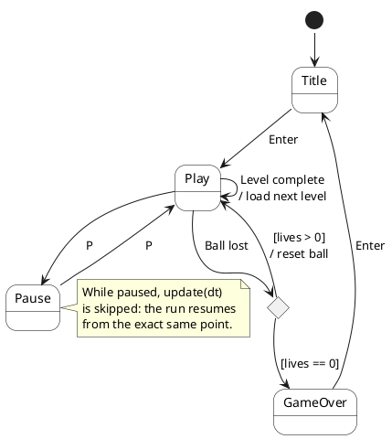
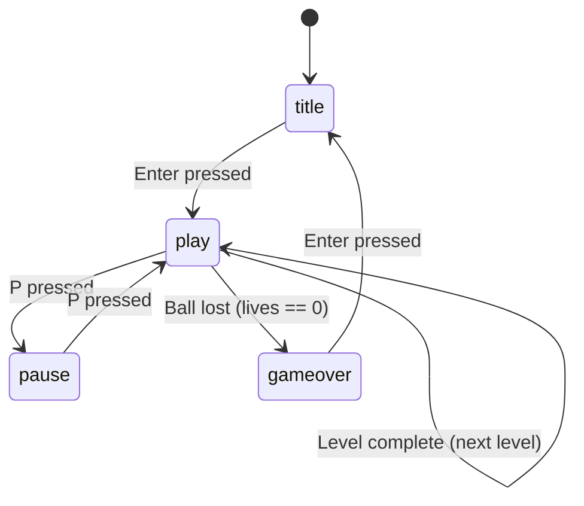

# State machine

The game flow is a finite state machine (FSM) owned by the `Game` class.
Each transition is triggered by an explicit **event**.

## States

| State    | Meaning                                   |
|----------|-------------------------------------------|
| `title`  | Start screen, waiting for the player      |
| `play`   | Active gameplay                           |
| `pause`  | Gameplay suspended                        |
| `gameover` | Final screen after lives run out        |

## Transitions

> Source: [`uml/state-machine.puml`](uml/state-machine.puml).

Mermaid source

## Edge cases covered

- **Ball lost** — if the player still has lives, return to `play` and reset
  the ball; otherwise transition to `gameover`.
- **Level complete** — when all bricks are destroyed, advance to the next
  level and stay in `play`.
- **Pause** — the game can be paused mid-run and resumed from the same state;
  `update(dt)` is skipped while paused so the game does not advance.